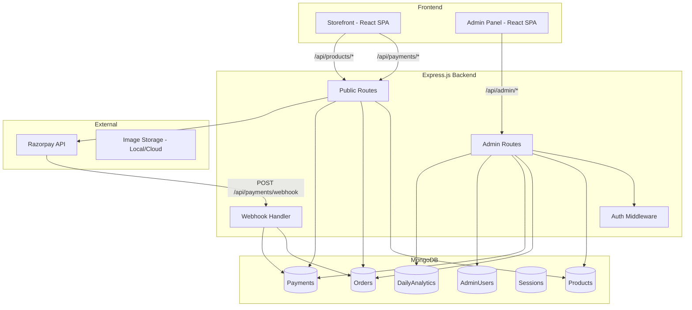
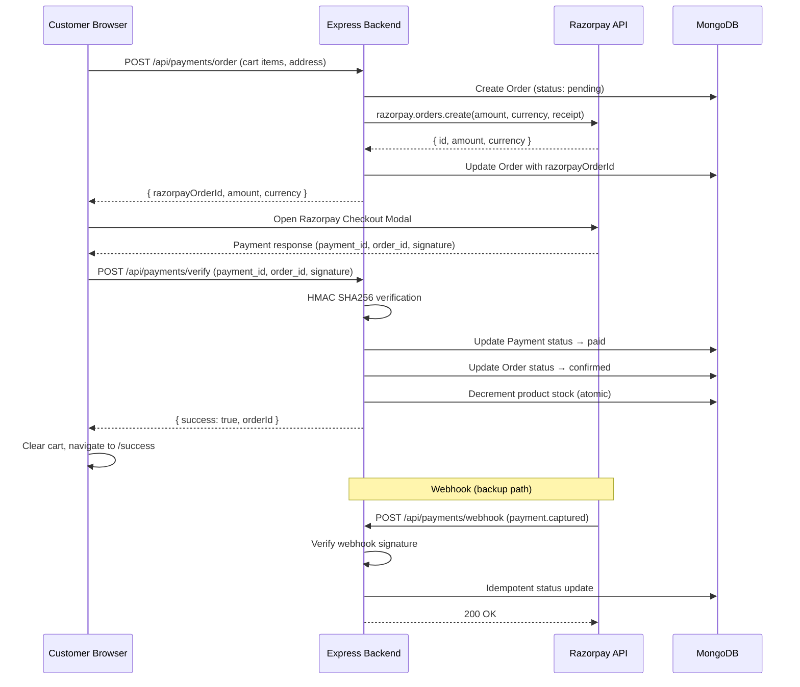
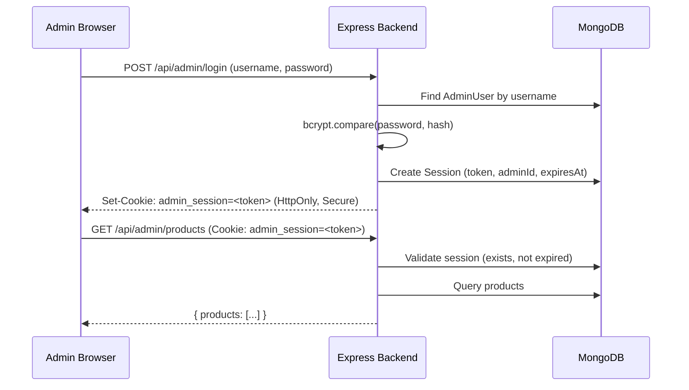

# Design Document: Admin Panel and Payments

## Overview

This design covers three interconnected subsystems for the Zarevielle e-commerce application:

1. **Admin Panel** — A separate, JWT-session-protected web interface at `/admin` for managing products, orders, payments, and viewing analytics
2. **MongoDB Data Layer** — Mongoose schemas for Products, Orders, Payments, AdminUsers, and DailyAnalytics replacing the current static data and Firestore usage
3. **Razorpay Payment Integration** — Full payment lifecycle from order creation through verification and webhook handling, integrated with the existing checkout flow

The system transitions from the current Firestore-based order storage and static product data to a MongoDB-backed architecture with proper payment verification and admin tooling.

## Architecture

### High-Level System Architecture



### Request Flow — Checkout with Razorpay



### Admin Authentication Flow



## Components and Interfaces

### Backend API Routes

#### Public Routes (No Auth Required)

| Method | Path | Description |
|--------|------|-------------|
| GET | `/api/products` | List products (paginated, filterable by category) |
| GET | `/api/products/:id` | Get single product |
| POST | `/api/payments/order` | Create Razorpay order |
| POST | `/api/payments/verify` | Verify payment signature |
| POST | `/api/payments/webhook` | Razorpay webhook endpoint |

#### Admin Routes (Session Auth Required)

| Method | Path | Description |
|--------|------|-------------|
| POST | `/api/admin/login` | Admin login |
| POST | `/api/admin/logout` | Admin logout |
| GET | `/api/admin/session` | Validate current session |
| GET | `/api/admin/products` | List all products (paginated) |
| POST | `/api/admin/products` | Create product |
| PUT | `/api/admin/products/:id` | Update product |
| DELETE | `/api/admin/products/:id` | Delete product |
| POST | `/api/admin/products/:id/images` | Upload product images |
| GET | `/api/admin/orders` | List orders (paginated, filterable) |
| GET | `/api/admin/orders/:id` | Get order detail |
| PATCH | `/api/admin/orders/:id/status` | Update order status |
| GET | `/api/admin/payments` | List payments (paginated, filterable) |
| GET | `/api/admin/payments/:id` | Get payment detail |
| GET | `/api/admin/analytics` | Get analytics data |

### Admin Panel Frontend Components

```
/admin (route prefix)
├── AdminLogin          — Login form
├── AdminLayout         — Sidebar nav + content area (no storefront Navbar/Footer)
│   ├── Dashboard       — Analytics overview with charts
│   ├── ProductList     — Paginated product table with actions
│   ├── ProductForm     — Add/Edit product form with color picker and image upload
│   ├── OrderList       — Paginated order table with filters
│   ├── OrderDetail     — Full order view with status update controls
│   ├── PaymentList     — Paginated payment table with filters
│   └── PaymentDetail   — Full payment/transaction view
└── AdminAuthGuard      — Route protection HOC (redirects to login if unauthenticated)
```

### Key Frontend Interfaces

```typescript
// Admin auth context
interface AdminAuthContext {
  admin: { username: string } | null;
  isAuthenticated: boolean;
  login: (username: string, password: string) => Promise<void>;
  logout: () => Promise<void>;
  checkSession: () => Promise<void>;
}

// API response types
interface PaginatedResponse<T> {
  data: T[];
  total: number;
  page: number;
  pageSize: number;
  totalPages: number;
}

interface AnalyticsData {
  ordersPlaced: number;
  ordersShipped: number;
  totalTransactions: number;
  totalRevenue: number;
  perProductRevenue: { productId: string; productName: string; amount: number }[];
  dailyTrend: { date: string; orders: number; revenue: number }[];
}
```

### Middleware Stack

```typescript
// Admin auth middleware
const adminAuth = async (req, res, next) => {
  const token = req.cookies?.admin_session;
  if (!token) return res.status(401).json({ error: 'Unauthorized' });
  
  const session = await Session.findOne({ token, expiresAt: { $gt: new Date() } });
  if (!session) return res.status(401).json({ error: 'Unauthorized' });
  
  const admin = await AdminUser.findById(session.adminId);
  if (!admin) return res.status(403).json({ error: 'Forbidden' });
  
  req.admin = admin;
  next();
};
```

### Image Upload Strategy

Product images will be stored on the local filesystem in a `/uploads/products/` directory served statically by Express. Each image is renamed to a UUID to prevent collisions. The upload endpoint uses `multer` middleware with:
- Max file size: 5 MB
- Accepted MIME types: `image/jpeg`, `image/png`, `image/webp`
- Max 10 files per product
- Files stored at: `/uploads/products/{uuid}.{ext}`
- URLs returned as: `/uploads/products/{uuid}.{ext}`

For production scaling, this can be swapped to cloud storage (S3, Cloudinary) by changing the multer storage engine without modifying the API contract.

## Data Models

### Product Schema (Mongoose)

```typescript
const ProductSchema = new Schema({
  name: { type: String, required: true, maxlength: 100 },
  description: { type: String, required: true, maxlength: 2000 },
  price: { type: Number, required: true, min: 0.01, max: 999999999.99 },
  category: { type: String, required: true, maxlength: 50 },
  colors: [{
    name: { type: String, required: true, maxlength: 50 },
    hexCode: { type: String, required: true, match: /^#[0-9A-Fa-f]{6}$/ }
  }],
  images: [{ type: String }],  // URL strings, max 10
  stock: { type: Number, required: true, min: 0, default: 0 },
  featured: { type: Boolean, default: false },
}, { timestamps: true });

ProductSchema.index({ category: 1 });
ProductSchema.index({ featured: 1 });
```

### Order Schema (Mongoose)

```typescript
const OrderItemSchema = new Schema({
  productId: { type: Schema.Types.ObjectId, ref: 'Product', required: true },
  name: { type: String, required: true },
  price: { type: Number, required: true, min: 0.01 },
  quantity: { type: Number, required: true, min: 1 },
  imageUrl: { type: String, required: true }
}, { _id: false });

const StatusHistorySchema = new Schema({
  status: { type: String, required: true },
  changedAt: { type: Date, default: Date.now }
}, { _id: false });

const OrderSchema = new Schema({
  userId: { type: String },
  customerEmail: { type: String, required: true },
  items: { type: [OrderItemSchema], required: true },
  totalAmount: { type: Number, required: true, min: 0.01, max: 999999.99 },
  status: {
    type: String,
    enum: ['placed', 'confirmed', 'shipped', 'out-for-delivery', 'delivered', 'cancelled'],
    default: 'placed'
  },
  shippingAddress: {
    fullName: { type: String, required: true },
    address: { type: String, required: true },
    city: { type: String, required: true },
    zipCode: { type: String, required: true }
  },
  paymentId: { type: String },
  razorpayOrderId: { type: String },
  statusHistory: [StatusHistorySchema],
  shippedAt: { type: Date },
}, { timestamps: true });

OrderSchema.index({ status: 1 });
OrderSchema.index({ createdAt: -1 });
OrderSchema.index({ customerEmail: 1 });
```

### Payment Schema (Mongoose)

```typescript
const PaymentSchema = new Schema({
  orderId: { type: Schema.Types.ObjectId, ref: 'Order', required: true },
  razorpayPaymentId: { type: String },
  razorpayOrderId: { type: String, required: true },
  razorpaySignature: { type: String },
  amount: { type: Number, required: true, min: 0.01, max: 999999.99 },
  currency: { type: String, required: true, default: 'INR', maxlength: 3 },
  status: {
    type: String,
    enum: ['pending', 'paid', 'failed', 'refunded'],
    default: 'pending'
  },
  method: { type: String, maxlength: 50 },
  customerEmail: { type: String, required: true },
}, { timestamps: true });

PaymentSchema.index({ status: 1 });
PaymentSchema.index({ createdAt: -1 });
PaymentSchema.index({ razorpayOrderId: 1 });
```

### AdminUser Schema (Mongoose)

```typescript
const AdminUserSchema = new Schema({
  username: { type: String, required: true, unique: true, minlength: 3, maxlength: 50 },
  passwordHash: { type: String, required: true },
  failedLoginAttempts: { type: Number, default: 0 },
  lockedUntil: { type: Date },
  lastLoginAt: { type: Date },
}, { timestamps: true });
```

### Session Schema (Mongoose)

```typescript
const SessionSchema = new Schema({
  token: { type: String, required: true, unique: true, index: true },
  adminId: { type: Schema.Types.ObjectId, ref: 'AdminUser', required: true },
  expiresAt: { type: Date, required: true },
  createdAt: { type: Date, default: Date.now },
});

SessionSchema.index({ expiresAt: 1 }, { expireAfterSeconds: 0 }); // TTL index for auto-cleanup
```

### DailyAnalytics Schema (Mongoose)

```typescript
const DailyAnalyticsSchema = new Schema({
  date: { type: Date, required: true, unique: true },
  ordersPlaced: { type: Number, default: 0, min: 0 },
  ordersShipped: { type: Number, default: 0, min: 0 },
  totalTransactions: { type: Number, default: 0, min: 0 },
  totalRevenue: { type: Number, default: 0, min: 0 },
  perProductRevenue: [{
    productId: { type: Schema.Types.ObjectId, ref: 'Product' },
    amount: { type: Number, default: 0 }
  }],
});

DailyAnalyticsSchema.index({ date: -1 });
```

### Analytics Aggregation Approach

Analytics data is computed on-demand using MongoDB aggregation pipelines rather than pre-computed snapshots. This avoids stale data and simplifies the architecture:

```typescript
// Daily orders count
Order.countDocuments({
  createdAt: { $gte: startOfDay, $lte: endOfDay }
});

// Revenue per product (aggregation pipeline)
Order.aggregate([
  { $match: { createdAt: { $gte: start, $lte: end }, status: { $ne: 'cancelled' } } },
  { $unwind: '$items' },
  { $group: { _id: '$items.productId', totalAmount: { $sum: { $multiply: ['$items.price', '$items.quantity'] } } } }
]);
```

The DailyAnalytics collection serves as a cache/snapshot for historical data. A scheduled job (or on-demand computation) populates it for past days. Current-day metrics are always computed live from Orders and Payments collections.

### Order Status Transition Logic

```typescript
const VALID_TRANSITIONS: Record<string, string[]> = {
  'placed': ['confirmed', 'cancelled'],
  'confirmed': ['shipped', 'cancelled'],
  'shipped': ['out-for-delivery', 'cancelled'],
  'out-for-delivery': ['delivered', 'cancelled'],
  'delivered': [],
  'cancelled': [],
};

function isValidTransition(currentStatus: string, newStatus: string): boolean {
  return VALID_TRANSITIONS[currentStatus]?.includes(newStatus) ?? false;
}
```

### Stock Decrement — Atomic Operation

```typescript
// Atomic stock decrement using findOneAndUpdate with condition
const result = await Product.findOneAndUpdate(
  { _id: productId, stock: { $gte: quantity } },
  { $inc: { stock: -quantity } },
  { new: true }
);
// If result is null, insufficient stock — reject the order
```


## Correctness Properties

*A property is a characteristic or behavior that should hold true across all valid executions of a system — essentially, a formal statement about what the system should do. Properties serve as the bridge between human-readable specifications and machine-verifiable correctness guarantees.*

### Property 1: Authentication correctness

*For any* username/password pair, if the pair matches a stored AdminUser record (with bcrypt verification), the login endpoint should return a valid session token; if the pair does not match any stored record, the endpoint should return a generic rejection error without revealing which field was incorrect.

**Validates: Requirements 1.2, 1.3**

### Property 2: Admin route protection

*For any* request to any `/api/admin/*` route, if the request does not carry a valid, unexpired session token, the system should respond with HTTP 401 and not disclose whether the route exists.

**Validates: Requirements 1.4, 12.3**

### Property 3: Session lifecycle

*For any* valid admin session, calling the logout endpoint should invalidate that session such that subsequent requests using the same token are rejected with 401.

**Validates: Requirements 1.5**

### Property 4: Password storage security

*For any* AdminUser stored in the database, the passwordHash field should be a valid bcrypt hash with a cost factor of at least 10.

**Validates: Requirements 1.6**

### Property 5: Product data round-trip

*For any* valid product data (name 1–100 chars, description 1–2000 chars, price 0.01–999999999.99, category ≤50 chars, colors ≤20 entries with valid hex codes, images 1–10 URLs, stock 0–99999), creating or updating a product should persist all fields to MongoDB such that reading the product back returns equivalent data.

**Validates: Requirements 2.2, 2.3, 2.4**

### Property 6: Product validation rejects invalid data

*For any* product data that violates at least one constraint (name empty or >100 chars, price ≤0 or >999999999.99, missing required field, hex code not matching #RRGGBB, >20 colors, >10 images), the system should reject the creation/update and return field-level error messages identifying each invalid field.

**Validates: Requirements 2.7, 2.5**

### Property 7: Stock quantity validation

*For any* numeric value V, the stock update validation should accept V if and only if V is a whole number in the range [0, 10000]. All other values (negative, fractional, >10000) should be rejected with an appropriate error.

**Validates: Requirements 3.2, 3.3**

### Property 8: Atomic stock decrement preserves non-negativity

*For any* order containing products with quantities, when payment is confirmed: if every product has sufficient stock (stock ≥ ordered quantity), then each product's stock should decrease by exactly the ordered quantity; if any product has insufficient stock, the entire operation should be rejected and no stock values should change.

**Validates: Requirements 3.4, 3.5**

### Property 9: Cart quantity capped at available stock

*For any* product with available stock S and any requested quantity Q where Q > S, the cart should limit the added quantity to S and display a notification indicating the maximum available.

**Validates: Requirements 3.7**

### Property 10: Order status state machine

*For any* order in status S and any target status T, the status transition should succeed if and only if T is in the valid transitions for S (placed→confirmed, confirmed→shipped, shipped→out-for-delivery, out-for-delivery→delivered, any non-delivered→cancelled). On success, the statusHistory array should grow by one entry containing T and a timestamp.

**Validates: Requirements 4.3, 4.5, 4.9, 7.8**

### Property 11: Filter correctness

*For any* collection of orders or payments and any filter criteria (status, date range, search query), all items in the filtered result set should satisfy the filter predicate, and no items satisfying the predicate should be excluded from the result.

**Validates: Requirements 4.7, 4.8, 5.3, 5.4**

### Property 12: List ordering

*For any* set of orders or payments returned by a list endpoint, the items should be sorted by creation date in descending order (newest first).

**Validates: Requirements 4.1, 5.1**

### Property 13: Revenue computation

*For any* set of payments within a filtered view, the displayed total revenue should equal the sum of the `amount` field for all payments with status "paid" in that set.

**Validates: Requirements 5.5**

### Property 14: Analytics aggregation correctness

*For any* date range [start, end] and set of orders and payments in the database, the analytics endpoint should return: ordersPlaced = count of orders with createdAt in [start, end]; ordersShipped = count of orders with status "shipped" and shippedAt in [start, end]; totalTransactions = count of payments with status "paid" and createdAt in [start, end]; totalRevenue = sum of amounts for those payments; perProductRevenue = sum of (price × quantity) grouped by productId from order items within the range.

**Validates: Requirements 6.1, 6.2, 6.3, 6.4, 6.5**

### Property 15: Amount conversion to paise

*For any* cart total amount T (in INR, range ₹1 to ₹9,99,999.99), the Razorpay order creation should send amount = T × 100 (converting to paise), and the value should be an integer between 100 and 99999999.

**Validates: Requirements 8.1**

### Property 16: Receipt uniqueness

*For any* two distinct orders created by the system, their receipt identifiers should be different strings, each no longer than 40 characters.

**Validates: Requirements 8.5**

### Property 17: Payment signature verification determines outcome

*For any* (razorpay_order_id, razorpay_payment_id, razorpay_signature) triple, the system should compute HMAC-SHA256 of `order_id|payment_id` using the Razorpay secret. If the computed value matches razorpay_signature, the payment status should become "paid" and the order status should become "confirmed". If it does not match, the payment status should become "failed" and the order status should remain unchanged.

**Validates: Requirements 10.1, 10.2, 10.3**

### Property 18: Verification request validation

*For any* payment verification request missing one or more of the required fields (razorpay_order_id, razorpay_payment_id, razorpay_signature), the system should reject the request with an error indicating the missing fields, without performing any signature computation or database updates.

**Validates: Requirements 10.6**

### Property 19: Webhook idempotence

*For any* valid webhook event (payment.captured or payment.failed), processing the same event N times (N ≥ 1) should produce the same final database state as processing it exactly once.

**Validates: Requirements 11.7**

### Property 20: Schema validation rejects invalid documents

*For any* document submitted to any Mongoose model (Product, Order, Payment, AdminUser) that is missing a required field or has a field value outside its defined type/range constraints, Mongoose validation should reject the document with an error identifying the invalid field.

**Validates: Requirements 7.7**

## Error Handling

### Backend Error Strategy

| Error Type | HTTP Status | Response Format | Logging |
|-----------|-------------|-----------------|---------|
| Validation error | 400 | `{ error: string, fields?: Record<string, string> }` | None (client error) |
| Authentication failure | 401 | `{ error: "Unauthorized" }` | Log IP + timestamp |
| Authorization failure | 403 | `{ error: "Forbidden" }` | Log IP + userId |
| Resource not found | 404 | `{ error: "Not found" }` | None |
| Rate limit (login lockout) | 429 | `{ error: "Account temporarily locked", retryAfter: number }` | Log IP + username |
| Razorpay API failure | 502 | `{ error: "Payment service unavailable" }` | Log full error + request details |
| Internal server error | 500 | `{ error: "Internal server error" }` | Log full stack trace |

### Frontend Error Handling

- **Network errors**: Display toast notification with retry option
- **Validation errors (400)**: Display field-level inline errors on forms
- **Auth errors (401)**: Redirect to login page (admin) or show login prompt (storefront)
- **Payment errors**: Display user-friendly message, keep form data, re-enable submit button
- **Timeout errors**: Display "request timed out" message with retry option

### Razorpay-Specific Error Handling

- **SDK load failure**: Catch in `loadRazorpay()`, display "payment service unavailable" message
- **Order creation timeout (30s)**: Backend returns 502, frontend shows retry option
- **Signature mismatch**: Backend marks payment as failed, returns error to frontend
- **Webhook signature failure**: Return 400, log IP + timestamp for security monitoring
- **Orphaned payment (order not found)**: Log event, return error, do not update any records

### Concurrent Access Handling

- **Stock decrement race condition**: Handled by MongoDB atomic `findOneAndUpdate` with `$gte` condition
- **Duplicate webhook delivery**: Handled by checking current payment status before updating (idempotent)
- **Session invalidation during request**: Middleware checks session validity per-request

## Testing Strategy

### Property-Based Testing

This feature contains significant business logic suitable for property-based testing: order state machine transitions, payment signature verification, stock management, input validation, filtering/sorting, and analytics aggregation.

**Library**: [fast-check](https://github.com/dubzzz/fast-check) (TypeScript property-based testing library)

**Configuration**:
- Minimum 100 iterations per property test
- Each test tagged with: `Feature: admin-panel-and-payments, Property {number}: {title}`

**Properties to implement as PBT**:
- Property 5: Product data round-trip
- Property 6: Product validation rejects invalid data
- Property 7: Stock quantity validation
- Property 8: Atomic stock decrement preserves non-negativity
- Property 10: Order status state machine
- Property 11: Filter correctness
- Property 12: List ordering
- Property 13: Revenue computation
- Property 14: Analytics aggregation correctness
- Property 15: Amount conversion to paise
- Property 17: Payment signature verification determines outcome
- Property 18: Verification request validation
- Property 19: Webhook idempotence
- Property 20: Schema validation rejects invalid documents

### Unit Tests (Example-Based)

- Admin login form renders correctly (Req 1.1)
- Account lockout after 5 failed attempts (Req 1.8)
- Session expiry after 24 hours (Req 1.7)
- Product deletion confirmation dialog (Req 2.6)
- Low-stock visual indicator (Req 3.1)
- Order detail displays all sections (Req 4.2)
- Shipped status records shippedAt date (Req 4.6)
- Payment detail shows Razorpay fields (Req 5.2)
- Analytics chart rendering (Req 6.7)
- Razorpay modal opens with correct config (Req 9.1)
- Checkout form preserved on payment cancel (Req 9.3)
- Loading state during payment processing (Req 9.4)
- SDK load failure handling (Req 9.6)
- Webhook endpoint returns 200 for valid events (Req 11.3, 11.4)
- Webhook rejects invalid signatures with 400 (Req 11.5)

### Integration Tests

- Full checkout flow: cart → order creation → Razorpay mock → verification → order saved
- Admin login → session creation → authenticated request → logout → rejected request
- Product CRUD lifecycle through API
- Order status progression through all valid states
- Webhook processing with mocked Razorpay signatures
- Analytics aggregation with seeded test data

### Test Infrastructure

- **Backend tests**: Vitest + fast-check + mongodb-memory-server (in-memory MongoDB for tests)
- **Frontend tests**: Vitest + React Testing Library + MSW (Mock Service Worker for API mocking)
- **Test database**: mongodb-memory-server provides isolated MongoDB instances per test suite
- **Razorpay mocking**: Mock the Razorpay SDK and webhook signatures using known test secrets
