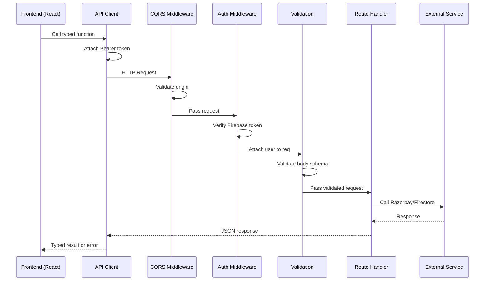

# Design Document: Backend API Separation

## Overview

This design separates the Zarevielle e-commerce application's monolithic `server.ts` into a standalone backend API service and a decoupled frontend client. The current architecture bundles Express API routes (payment processing) with Vite dev middleware in a single file. The new architecture introduces:

- A dedicated `server/` directory containing an independent Express API service with its own package.json, TypeScript config, and build pipeline
- Versioned RESTful endpoints under `/api/v1` organized by domain (health, payments, orders)
- Firebase Admin SDK-based authentication middleware for protected routes
- A typed frontend API client module that centralizes all HTTP communication
- Independent development workflows where frontend and backend run on separate ports

The separation enables independent deployment, clearer ownership boundaries, and the ability to scale the API independently of the static frontend.

## Architecture

### High-Level System Diagram

```mermaid
graph TB
    subgraph "Frontend (Vite Dev Server - port 5173)"
        FE[React SPA]
        AC[API Client Module]
        FE --> AC
    end

    subgraph "Backend API (Express - port 3000)"
        CORS[CORS Middleware]
        AUTH[Auth Middleware]
        VAL[Validation Middleware]
        
        subgraph "Route Handlers"
            HEALTH[/api/v1/health]
            PAY[/api/v1/payments/*]
            ORD[/api/v1/orders/*]
        end
        
        CORS --> AUTH
        AUTH --> VAL
        VAL --> HEALTH
        VAL --> PAY
        VAL --> ORD
    end

    subgraph "External Services"
        FB[Firebase Auth / Firestore]
        RP[Razorpay API]
    end

    AC -->|HTTP + Bearer Token| CORS
    PAY --> RP
    PAY --> FB
    ORD --> FB
    AUTH --> FB
```

### Project Directory Layout

```
zarevielle/
├── server/                          # Standalone API service
│   ├── src/
│   │   ├── index.ts                 # Entry point - bootstraps Express app
│   │   ├── app.ts                   # Express app factory (for testability)
│   │   ├── config/
│   │   │   ├── env.ts               # Environment variable validation & loading
│   │   │   └── firebase.ts          # Firebase Admin SDK initialization
│   │   ├── middleware/
│   │   │   ├── auth.ts              # Firebase token verification
│   │   │   ├── cors.ts              # CORS configuration
│   │   │   ├── validation.ts        # Request body validation
│   │   │   └── errorHandler.ts      # Global error handler
│   │   ├── routes/
│   │   │   ├── index.ts             # Route aggregator (mounts all routers)
│   │   │   ├── health.ts            # GET /api/v1/health
│   │   │   ├── payments.ts          # POST /api/v1/payments/orders, /verify
│   │   │   └── orders.ts            # POST /api/v1/orders
│   │   ├── services/
│   │   │   ├── razorpay.ts          # Razorpay SDK wrapper
│   │   │   └── orderService.ts      # Order persistence logic
│   │   └── types/
│   │       └── index.ts             # Shared server-side types
│   ├── package.json
│   ├── tsconfig.json
│   ├── .env.example
│   └── .env                         # (gitignored)
├── src/                             # Frontend React app (unchanged location)
│   ├── lib/
│   │   ├── apiClient.ts             # NEW: Typed API client
│   │   ├── firebase.ts              # Existing Firebase client SDK
│   │   └── razorpay.ts              # Existing Razorpay script loader
│   └── ...
├── vite.config.ts                   # Updated with API proxy
├── package.json                     # Frontend-only dependencies
└── ...
```

### Request Flow



## Components and Interfaces

### 1. Express App Factory (`server/src/app.ts`)

Creates and configures the Express application. Separated from the entry point for testability.

```typescript
// server/src/app.ts
import express, { Express } from 'express';
import { configureCors } from './middleware/cors';
import { errorHandler } from './middleware/errorHandler';
import { mountRoutes } from './routes';

export function createApp(): Express {
  const app = express();

  // Body parsing with 1MB limit
  app.use(express.json({ limit: '1mb' }));

  // CORS
  app.use(configureCors());

  // Routes
  mountRoutes(app);

  // Global error handler (must be last)
  app.use(errorHandler);

  return app;
}
```

### 2. Environment Configuration (`server/src/config/env.ts`)

Validates and exports typed environment configuration at startup.

```typescript
// server/src/config/env.ts
export interface EnvConfig {
  port: number;
  razorpayKeyId: string;
  razorpayKeySecret: string;
  firebaseProjectId: string;
  allowedOrigins: string[];
  nodeEnv: 'development' | 'production' | 'test';
}

export function loadAndValidateEnv(): EnvConfig {
  // Validates required vars, exits with non-zero if missing
  // Returns typed config object
}
```

### 3. Authentication Middleware (`server/src/middleware/auth.ts`)

```typescript
// server/src/middleware/auth.ts
import { Request, Response, NextFunction } from 'express';

export interface AuthenticatedRequest extends Request {
  user?: {
    uid: string;
    email?: string;
  };
}

export function authMiddleware(
  req: AuthenticatedRequest,
  res: Response,
  next: NextFunction
): void {
  // 1. Extract Bearer token from Authorization header
  // 2. Verify with Firebase Admin SDK
  // 3. Attach decoded user to req.user
  // 4. Call next() or return 401/503
}
```

### 4. CORS Middleware (`server/src/middleware/cors.ts`)

```typescript
// server/src/middleware/cors.ts
import { RequestHandler } from 'express';

export function configureCors(): RequestHandler {
  // Reads ALLOWED_ORIGINS from env config
  // Returns middleware that:
  //   - Allows requests from listed origins
  //   - Returns 403 for disallowed origins
  //   - Handles preflight with 204 + cache headers
  //   - Passes through requests without Origin header
}
```

### 5. Validation Middleware (`server/src/middleware/validation.ts`)

```typescript
// server/src/middleware/validation.ts
import { Request, Response, NextFunction } from 'express';

interface ValidationSchema {
  [field: string]: {
    required?: boolean;
    type?: 'string' | 'number' | 'object' | 'array';
    min?: number;
    max?: number;
    maxLength?: number;
    pattern?: RegExp;
    custom?: (value: unknown) => string | null; // returns error message or null
  };
}

export function validate(schema: ValidationSchema): RequestHandler {
  // Returns middleware that validates req.body against schema
  // Returns 400 with { error, fields[] } on failure
}
```

### 6. Route Handlers

#### Health Route (`server/src/routes/health.ts`)
```typescript
// No auth required
router.get('/', (req, res) => {
  res.json({ status: 'ok', timestamp: new Date().toISOString() });
});
```

#### Payments Route (`server/src/routes/payments.ts`)
```typescript
// Auth required for both endpoints
router.post('/orders', authMiddleware, validate(orderSchema), createOrder);
router.post('/verify', authMiddleware, validate(verifySchema), verifyPayment);
```

#### Orders Route (`server/src/routes/orders.ts`)
```typescript
// Auth required
router.post('/', authMiddleware, validate(orderRecordSchema), createOrderRecord);
```

### 7. Frontend API Client (`src/lib/apiClient.ts`)

```typescript
// src/lib/apiClient.ts
export interface ApiError {
  status: number;
  message: string;
  fields?: Array<{ field: string; reason: string }>;
}

export interface CreateOrderRequest {
  amount: number;
  currency?: string;
}

export interface CreateOrderResponse {
  id: string;
  amount: number;
  currency: string;
}

export interface VerifyPaymentRequest {
  razorpay_order_id: string;
  razorpay_payment_id: string;
  razorpay_signature: string;
}

export interface VerifyPaymentResponse {
  status: 'success' | 'failure';
}

export interface HealthResponse {
  status: string;
  timestamp: string;
}

class ApiClient {
  private baseUrl: string;
  private timeout: number = 30000;

  constructor() {
    if (!import.meta.env.VITE_API_URL) {
      throw new Error('VITE_API_URL environment variable is not defined');
    }
    this.baseUrl = import.meta.env.VITE_API_URL;
  }

  async createPaymentOrder(data: CreateOrderRequest): Promise<CreateOrderResponse>;
  async verifyPayment(data: VerifyPaymentRequest): Promise<VerifyPaymentResponse>;
  async healthCheck(): Promise<HealthResponse>;
}

export const apiClient = new ApiClient();
```

### 8. Razorpay Service (`server/src/services/razorpay.ts`)

```typescript
// server/src/services/razorpay.ts
import Razorpay from 'razorpay';

export class RazorpayService {
  private client: Razorpay;

  constructor(keyId: string, keySecret: string) {
    this.client = new Razorpay({ key_id: keyId, key_secret: keySecret });
  }

  async createOrder(amount: number, currency: string): Promise<RazorpayOrder>;
  verifySignature(orderId: string, paymentId: string, signature: string): boolean;
}
```

### 9. Order Service (`server/src/services/orderService.ts`)

```typescript
// server/src/services/orderService.ts
export class OrderService {
  async createOrder(data: CreateOrderData, userId: string): Promise<string>;
  // Returns the created order ID
}
```

## Data Models

### Server-Side Types (`server/src/types/index.ts`)

```typescript
// === Request Types ===

export interface CreatePaymentOrderRequest {
  amount: number;        // 1.00 to 999,999.99
  currency?: string;     // ISO 4217, defaults to 'USD'
}

export interface VerifyPaymentRequest {
  razorpay_order_id: string;
  razorpay_payment_id: string;
  razorpay_signature: string;
}

export interface CreateOrderRecordRequest {
  paymentId: string;
  items: OrderItemData[];       // 1-50 items
  shippingAddress: ShippingAddress;
  customerEmail: string;        // valid email format
  totalAmount: number;          // > 0
}

export interface OrderItemData {
  productId: string;
  name: string;
  price: number;
  quantity: number;
  imageUrl: string;
}

export interface ShippingAddress {
  fullName: string;    // non-empty, max 200 chars
  address: string;     // non-empty, max 200 chars
  city: string;        // non-empty, max 200 chars
  zipCode: string;     // non-empty, max 200 chars
}

// === Response Types ===

export interface PaymentOrderResponse {
  id: string;
  amount: number;
  currency: string;
}

export interface PaymentVerifyResponse {
  status: 'success' | 'failure';
}

export interface OrderRecordResponse {
  orderId: string;
  status: 'paid';
}

export interface HealthResponse {
  status: 'ok';
  timestamp: string;   // ISO 8601
}

// === Error Types ===

export interface ApiErrorResponse {
  error: string;
  fields?: FieldError[];
}

export interface FieldError {
  field: string;
  reason: string;
}

// === Internal Types ===

export interface OrderRecord {
  paymentId: string;
  items: OrderItemData[];
  shippingAddress: ShippingAddress;
  customerEmail: string;
  totalAmount: number;
  userId: string;
  status: 'paid';
  createdAt: FirebaseFirestore.Timestamp;
}

export interface DecodedUser {
  uid: string;
  email?: string;
}
```

### Frontend Types (additions to `src/types.ts`)

The existing `Order`, `OrderItem` types remain unchanged. The API client adds its own request/response interfaces (shown in the API Client section above).

### Environment Variable Schema

| Variable | Location | Required | Format | Default |
|----------|----------|----------|--------|---------|
| `RAZORPAY_KEY_ID` | server/.env | Yes | String (rzp_*) | — |
| `RAZORPAY_KEY_SECRET` | server/.env | Yes | String | — |
| `FIREBASE_PROJECT_ID` | server/.env | Yes | String | — |
| `ALLOWED_ORIGINS` | server/.env | Yes | Comma-separated URLs | — |
| `PORT` | server/.env | No | Integer 1-65535 | 3000 |
| `NODE_ENV` | server/.env | No | development/production/test | development |
| `VITE_API_URL` | .env | Yes (build) | URL | — |
| `VITE_RAZORPAY_KEY_ID` | .env | Yes (build) | String | — |


## Correctness Properties

*A property is a characteristic or behavior that should hold true across all valid executions of a system — essentially, a formal statement about what the system should do. Properties serve as the bridge between human-readable specifications and machine-verifiable correctness guarantees.*

### Property 1: Input validation returns structured 400 errors

*For any* request body that fails schema validation (missing required fields, wrong types, out-of-range values, invalid formats, or malformed JSON), the API server SHALL return HTTP 400 with a JSON response containing an `error` string and, when applicable, a `fields` array where each entry identifies the invalid field name and rejection reason.

**Validates: Requirements 2.4, 3.4, 3.5, 8.2, 8.5**

### Property 2: Server errors never expose internal details

*For any* unhandled exception or internal error that occurs during request processing, the API server SHALL return HTTP 500 with a JSON response containing only a generic `error` message, and the response body SHALL NOT contain stack traces, file paths, internal variable names, or database connection strings.

**Validates: Requirements 2.5, 8.3, 8.4**

### Property 3: Non-existent endpoints return 404

*For any* request path that does not match a registered route under `/api/v1`, the API server SHALL return HTTP 404 with a JSON response containing an `error` field.

**Validates: Requirements 2.6**

### Property 4: Payment order creation produces valid response

*For any* valid amount (between 1.00 and 999,999.99) and supported currency code (USD or INR), the payment order creation endpoint SHALL return a JSON response containing a non-empty `id` string, an `amount` equal to the input amount converted to subunits, and a `currency` matching the requested currency.

**Validates: Requirements 3.1**

### Property 5: Signature verification correctness

*For any* combination of order ID and payment ID, computing the HMAC-SHA256 with the correct secret produces a signature that the verification endpoint accepts (returns success), and *for any* signature that does not match the computed HMAC-SHA256, the verification endpoint SHALL reject it with HTTP 400.

**Validates: Requirements 3.2, 3.6**

### Property 6: Valid auth tokens grant access

*For any* request to a protected endpoint that includes a valid, non-expired Firebase ID token in the `Authorization: Bearer <token>` header, the auth middleware SHALL decode the token and attach the user's UID to the request object, allowing the request to proceed to the route handler.

**Validates: Requirements 4.1**

### Property 7: Invalid auth tokens are rejected

*For any* request to a protected endpoint where the Authorization header is missing, does not follow `Bearer <token>` format, contains an expired token, or contains a token that fails signature verification, the auth middleware SHALL return HTTP 401 with an error message and SHALL NOT pass control to the route handler.

**Validates: Requirements 4.2, 4.3**

### Property 8: CORS origin filtering

*For any* request with an `Origin` header, if the origin matches one of the values in `CORS_ALLOWED_ORIGINS`, the response SHALL include `Access-Control-Allow-Origin` set to that origin; if the origin does NOT match any allowed value, the server SHALL respond with HTTP 403 and an empty body.

**Validates: Requirements 5.1, 5.2**

### Property 9: API client attaches auth token to requests

*For any* API call made through the API client when the user is authenticated, the outgoing HTTP request SHALL include an `Authorization` header with the value `Bearer <current_firebase_id_token>`.

**Validates: Requirements 6.2**

### Property 10: API client maps non-2xx responses to typed errors

*For any* HTTP response with a status code outside the 200-299 range, the API client SHALL throw an error object containing the numeric `status` code and the `message` string parsed from the response body's `error` field.

**Validates: Requirements 6.3**

### Property 11: Order creation persists all required fields

*For any* valid order creation request (valid payment ID, 1-50 items with required fields, valid shipping address, valid email, positive total amount), the API server SHALL persist a Firestore document containing all provided fields plus a `status` of `"paid"`, a `userId` matching the authenticated user, and a `createdAt` timestamp, and SHALL return the created document ID.

**Validates: Requirements 9.1, 9.5**

### Property 12: Invalid orders are rejected without persistence

*For any* order creation request that is missing required fields, has zero items, exceeds 50 items, has a non-positive total amount, has an invalid email format, or has shipping address fields that are empty or exceed 200 characters, the API server SHALL return HTTP 400 and SHALL NOT write any document to Firestore.

**Validates: Requirements 9.2, 9.3**

### Property 13: Environment validation completeness

*For any* subset of the required environment variables (`RAZORPAY_KEY_ID`, `RAZORPAY_KEY_SECRET`, `FIREBASE_PROJECT_ID`, `ALLOWED_ORIGINS`) where at least one is missing, the API server startup SHALL log an error message naming each missing variable and exit with a non-zero status code.

**Validates: Requirements 10.1, 10.2**

## Error Handling

### Error Response Format

All error responses follow a consistent JSON structure:

```typescript
// Standard error response
{
  "error": "Human-readable error description"
}

// Validation error response (400 with field details)
{
  "error": "Validation failed",
  "fields": [
    { "field": "amount", "reason": "Must be a positive number between 1.00 and 999,999.99" },
    { "field": "currency", "reason": "Must be a supported ISO 4217 code (USD, INR)" }
  ]
}
```

### Error Handling Strategy by Layer

| Layer | Error Type | Handling |
|-------|-----------|----------|
| Body Parser | Malformed JSON | 400 with "Request body is malformed" |
| Body Parser | Body > 1MB | 400 with "Request body exceeds maximum size" |
| CORS Middleware | Disallowed origin | 403 with empty body |
| Auth Middleware | Missing/malformed token | 401 with "Authentication credentials missing or malformed" |
| Auth Middleware | Expired token | 401 with "Token has expired" |
| Auth Middleware | Invalid token | 401 with "Invalid authentication token" |
| Auth Middleware | Firebase unavailable | 503 with "Authentication service temporarily unavailable" |
| Validation Middleware | Schema violation | 400 with error + fields array |
| Route Handler | Business logic error | Appropriate 4xx with descriptive error |
| Route Handler | External service timeout | 503 with "Service temporarily unavailable" |
| Global Error Handler | Unhandled exception | 500 with "Internal server error" (logs full details) |

### Global Error Handler Implementation

```typescript
// server/src/middleware/errorHandler.ts
import { Request, Response, NextFunction } from 'express';

export function errorHandler(
  err: Error,
  req: Request,
  res: Response,
  next: NextFunction
): void {
  // Log full error details server-side
  console.error(JSON.stringify({
    timestamp: new Date().toISOString(),
    method: req.method,
    path: req.path,
    error: err.message,
    stack: err.stack,
    requestId: req.headers['x-request-id'],
  }));

  // Never expose internal details to client
  if (!res.headersSent) {
    res.status(500).json({ error: 'Internal server error' });
  }
}
```

### Timeout Handling

- **Razorpay API calls**: 10-second timeout using AbortController. On timeout, return 503.
- **Firestore operations**: 10-second timeout. On timeout, return 500 with generic message.
- **Frontend API client**: 30-second timeout per request using AbortController. On timeout, throw typed timeout error.

## Testing Strategy

### Testing Approach

This feature uses a dual testing approach:

1. **Property-based tests** — Verify universal properties across randomized inputs (validation logic, error handling, CORS filtering, auth middleware, signature verification)
2. **Unit tests** — Verify specific examples, edge cases, and integration points
3. **Integration tests** — Verify end-to-end flows with mocked external services

### Property-Based Testing Configuration

- **Library**: [fast-check](https://github.com/dubzzz/fast-check) (TypeScript-native PBT library)
- **Minimum iterations**: 100 per property test
- **Tag format**: `Feature: backend-api-separation, Property {N}: {description}`
- Each property test maps to exactly one correctness property from this design document

### Test Organization

```
server/
├── src/
│   └── ...
├── tests/
│   ├── properties/              # Property-based tests
│   │   ├── validation.prop.ts   # Properties 1, 12
│   │   ├── errorHandling.prop.ts # Property 2
│   │   ├── routing.prop.ts      # Property 3
│   │   ├── payments.prop.ts     # Properties 4, 5
│   │   ├── auth.prop.ts         # Properties 6, 7
│   │   ├── cors.prop.ts         # Property 8
│   │   └── env.prop.ts          # Property 13
│   ├── unit/                    # Example-based unit tests
│   │   ├── health.test.ts
│   │   ├── payments.test.ts
│   │   ├── orders.test.ts
│   │   ├── auth.test.ts
│   │   └── cors.test.ts
│   └── integration/             # End-to-end with mocked services
│       ├── paymentFlow.test.ts
│       └── orderFlow.test.ts
src/
├── lib/
│   └── __tests__/
│       ├── apiClient.prop.ts    # Properties 9, 10
│       └── apiClient.test.ts    # Examples for retry, timeout
```

### Unit Test Coverage

Unit tests focus on:
- Health endpoint response shape and timing (Req 2.3)
- Specific auth scenarios: missing header, expired token, Firebase unavailable (Req 4.4, 4.5, 4.6)
- CORS preflight response headers and cache duration (Req 5.3, 5.4, 5.5)
- API client initialization failure without VITE_API_URL (Req 6.4)
- Token refresh and retry behavior (Req 6.5, 6.6)
- Request timeout behavior (Req 6.7)
- Razorpay service unavailability (Req 3.3)
- Firestore persistence failure (Req 9.4)

### Integration Test Coverage

Integration tests verify:
- Full payment flow: order creation → Razorpay checkout → verification → order persistence
- Auth flow: login → get token → make authenticated request → receive response
- Error propagation: external service failure → appropriate error response to client

### Test Runner

- **Server tests**: Vitest (consistent with Vite ecosystem, fast, TypeScript-native)
- **Frontend tests**: Vitest with jsdom environment
- **Run command**: `vitest --run` (single execution, no watch mode)

### Mocking Strategy

| External Dependency | Mock Approach |
|-------------------|---------------|
| Razorpay SDK | Jest/Vitest mock of `razorpay` module |
| Firebase Admin SDK | Mock `firebase-admin/auth` verifyIdToken |
| Firestore | Mock `firebase-admin/firestore` collection/addDoc |
| fetch (frontend) | MSW (Mock Service Worker) or manual fetch mock |

